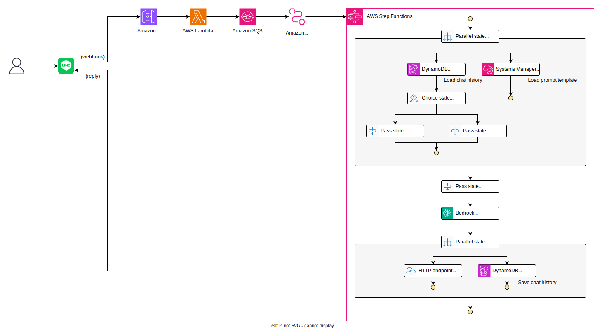
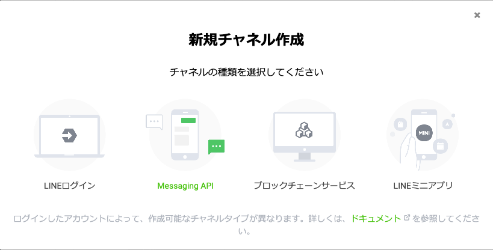
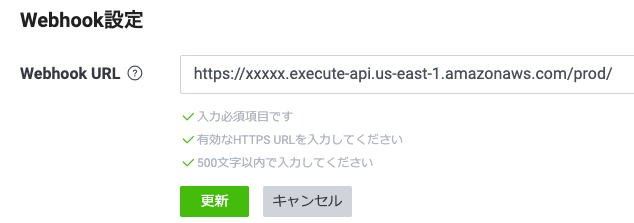
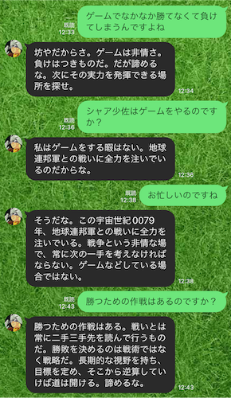

# LINE AI Chatbot with Amazon Bedrock

[日本語の情報 (for Japanese)](https://blog.msysh.me/posts/2024/01/line_bot_with_amazon_bedrock.html)

This project is an AI Chat Bot using Amazon Bedrock for LINE (LINE is the popular messaging app in Japan).

It features a serverless chatbot implemented in less code using Bedrock, AWS' generative AI service, and Step Functions, a workflow service.

## Architecture



## Pre-requirement

First, make Anthropic's Claude available through Amazon Bedrock's "Model access" in the AWS Management Console. See the [documentation](https://docs.aws.amazon.com/bedrock/latest/userguide/model-access.html) for details.

This project are provisioned by the AWS Cloud Development Kit (CDK). If you have not installed the CDK, first install it by referring to the [documents](https://docs.aws.amazon.com/cdk/v2/guide/getting_started.html).

Then, since it is a LINE bot, it is necessary to create a channel used the LINE Messaging API. You can create that channel after creating a provider in the [LINE Developers console](https://developers.line.biz/console/).

## How to setup

### 1. Create LINE Channel

In the [LINE Developers console](https://developers.line.biz/console/), create a provider and create a channel used the Messaging API.



### 2. Enable Webhook URL

Enable "Webhook URL" in LINE Developer console.


### 3. Issue "Channel secret" and "Channel access token"

**Channel secret** can be issued in "Basic settings" tab.  
**Channel access token** can be issued in "Messaging API" tab.

Note both values.

### 4. Configure CDK context parameter

Set values in the home directory `~/.cdk.json` with the channel secret and access token of LINE issued in previous step as parameters. If the file does not exist, create it.

_It will work even if you set the secret in `cdk.json` in the repository, but it is safer to set it in a file in your home directory because there is a risk of accidentally pushing the secret and having it published._

Add `"line-bot-with-amazon-bedrock": {...}` the following:

```json
{
  //   :
  // (snip)
  //   :
  "line-bot-with-amazon-bedrock": {
    "secret": "...(channel secret)...",
    "accessToken": "...(channel access token)..."
  }
}
```

### 5. Clone this repository

```sh
git clone https://github.com/msysh/aws-sample-line-bot-with-amazon-bedrock.git
```

### 6. Provision AWS resources

```sh
cd line-bot-with-amazon-bedrock
cdk deploy --all
```

### 7. Configure Webhook URL

You can get an API Gateway URL endpoint from cdk deploy output.

```
LineBotWithAmazonBedrock.ApiGatewayEndpointXXX = https://xxxxx.execute-api.us-east-1.amazonaws.com/prod/
```

Configure the endpoint URL as Webhook URL in LINE Developers console.



### 8. Add as friend in LINE app

Use the QR code displayed in the "Messaging API" tab in the LINE Developers console to add a friend and have a conversation!

### 9. Customize prompt

If you want to customize the prompt, go to the AWS Management Console and change the parameter `/line-bot-with-amazon-bedrock/prompt-template` in the Systems Manager Parameter Store. 

The first `{}` will be replaced by the conversation history and the second `{}` by the message from user.

## Clean up

If you want to delete an AWS resource, execute the following command:

```sh
cdk destroy --all
```

## Chat Sample with prompt engineering

Prompt engineering allows for chatbots with a variety of characters.



## License

MIT